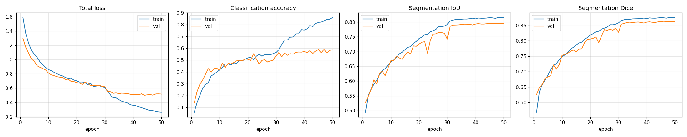
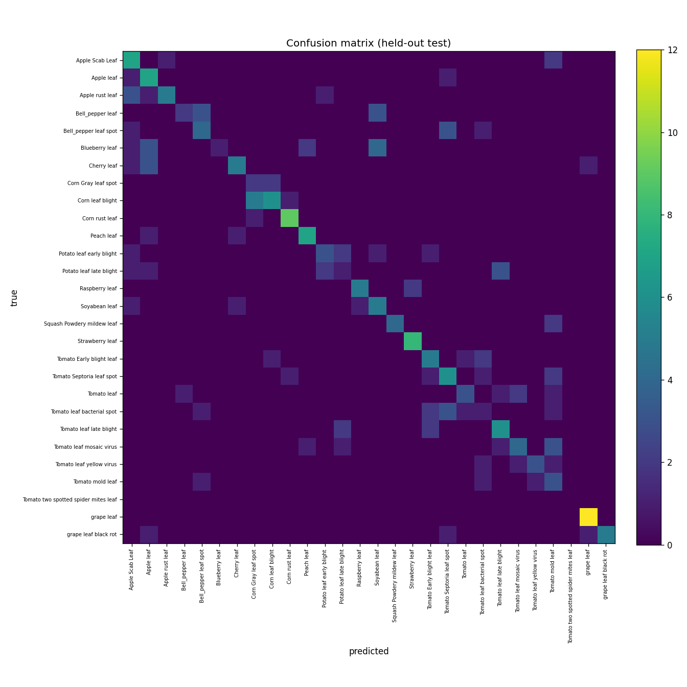

# LeafLens — training report

- **Model version:** 0.1.0
- **Created (UTC):** 2026-06-18T19:46:10.691380+00:00
- **Classes:** 28
- **Config:** batch_size=32, head_epochs=30, finetune_epochs=30, head_lr=0.001, finetune_lr=1e-05, seg_sample_ratio=0.5, augment=True, use_class_weights=True

## Validation metrics (mixed multi-task stream)

| metric | value |
|---|---|
| classification_accuracy | 0.5762 |
| classification_loss | 0.3711 |
| loss | 0.5008 |
| segmentation_dice | 0.8613 |
| segmentation_iou | 0.7946 |
| segmentation_loss | 0.1341 |

## Held-out evaluation

**Segmentation (val split):** IoU 0.7946, Dice 0.8613 over 705 images.
**Classification (held-out test):** accuracy 0.5466 over 236 images.

### Per-class (precision / recall / f1)

| class | precision | recall | f1 | support |
|---|---|---|---|---|
| Apple Scab Leaf | 0.41 | 0.70 | 0.52 | 10 |
| Apple leaf | 0.41 | 0.78 | 0.54 | 9 |
| Apple rust leaf | 0.83 | 0.50 | 0.62 | 10 |
| Bell_pepper leaf | 0.67 | 0.25 | 0.36 | 8 |
| Bell_pepper leaf spot | 0.44 | 0.44 | 0.44 | 9 |
| Blueberry leaf | 1.00 | 0.09 | 0.17 | 11 |
| Cherry leaf | 0.71 | 0.50 | 0.59 | 10 |
| Corn Gray leaf spot | 0.25 | 0.50 | 0.33 | 4 |
| Corn leaf blight | 0.67 | 0.50 | 0.57 | 12 |
| Corn rust leaf | 0.82 | 0.90 | 0.86 | 10 |
| Peach leaf | 0.70 | 0.78 | 0.74 | 9 |
| Potato leaf early blight | 0.50 | 0.38 | 0.43 | 8 |
| Potato leaf late blight | 0.17 | 0.12 | 0.14 | 8 |
| Raspberry leaf | 0.83 | 0.71 | 0.77 | 7 |
| Soyabean leaf | 0.38 | 0.62 | 0.48 | 8 |
| Squash Powdery mildew leaf | 1.00 | 0.67 | 0.80 | 6 |
| Strawberry leaf | 0.80 | 1.00 | 0.89 | 8 |
| Tomato Early blight leaf | 0.45 | 0.56 | 0.50 | 9 |
| Tomato Septoria leaf spot | 0.43 | 0.55 | 0.48 | 11 |
| Tomato leaf | 0.60 | 0.38 | 0.46 | 8 |
| Tomato leaf bacterial spot | 0.14 | 0.11 | 0.12 | 9 |
| Tomato leaf late blight | 0.55 | 0.60 | 0.57 | 10 |
| Tomato leaf mosaic virus | 0.57 | 0.40 | 0.47 | 10 |
| Tomato leaf yellow virus | 0.75 | 0.50 | 0.60 | 6 |
| Tomato mold leaf | 0.20 | 0.50 | 0.29 | 6 |
| grape leaf | 0.86 | 1.00 | 0.92 | 12 |
| grape leaf black rot | 1.00 | 0.62 | 0.77 | 8 |
| macro avg | 0.60 | 0.54 | 0.53 | 236 |
| weighted avg | 0.61 | 0.55 | 0.54 | 236 |

## Training curves

## Confusion matrix

