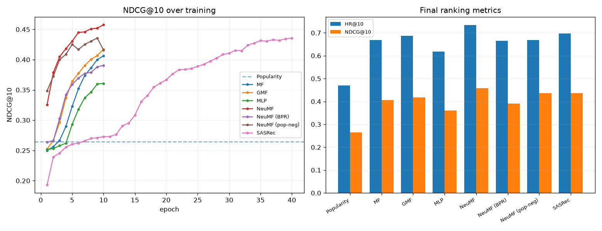

# Benchmark — ml-100k

Leave-one-out evaluation (held-out item vs. 99 sampled negatives). Trained for 10 epochs each; same seed, embedding dim 32, MLP layers [64, 32, 16, 8].

| Model | Objective | HR@10 | NDCG@10 |
|---|---|---:|---:|
| NeuMF **★** | bce | 0.7335 | 0.4576 |
| NeuMF (pop-neg) | bce | 0.6677 | 0.4358 |
| SASRec | bce-seq | 0.6964 | 0.4356 |
| GMF | bce | 0.6868 | 0.4173 |
| MF | bce | 0.6688 | 0.4065 |
| NeuMF (BPR) | bpr | 0.6656 | 0.3905 |
| MLP | bce | 0.6178 | 0.3607 |
| Popularity | bce | 0.4692 | 0.2646 |

★ best NDCG@10. Higher is better for both metrics.

Notes: **NeuMF (pop-neg)** uses popularity-aware (hard) negatives instead of uniform. **SASRec** is the sequential model; it converges much more slowly, so it was trained for 40 epochs (vs 10) — at the shared 10-epoch budget it sits near the popularity floor, but given more steps it reaches the learned-model range.

